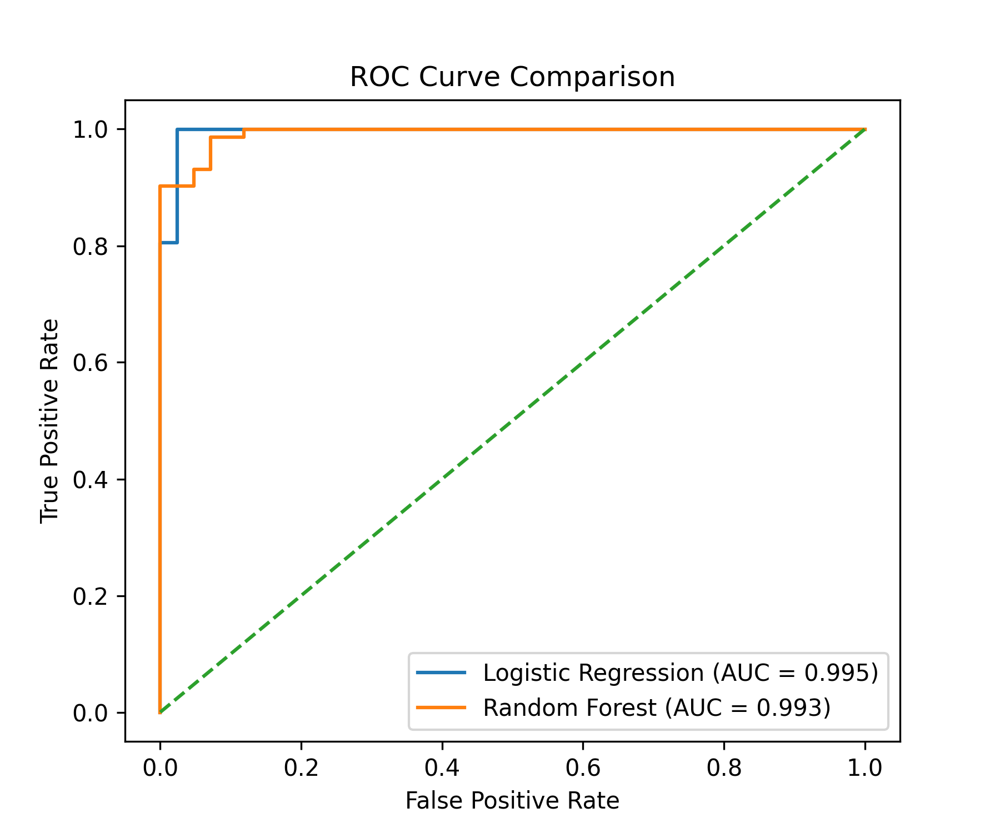
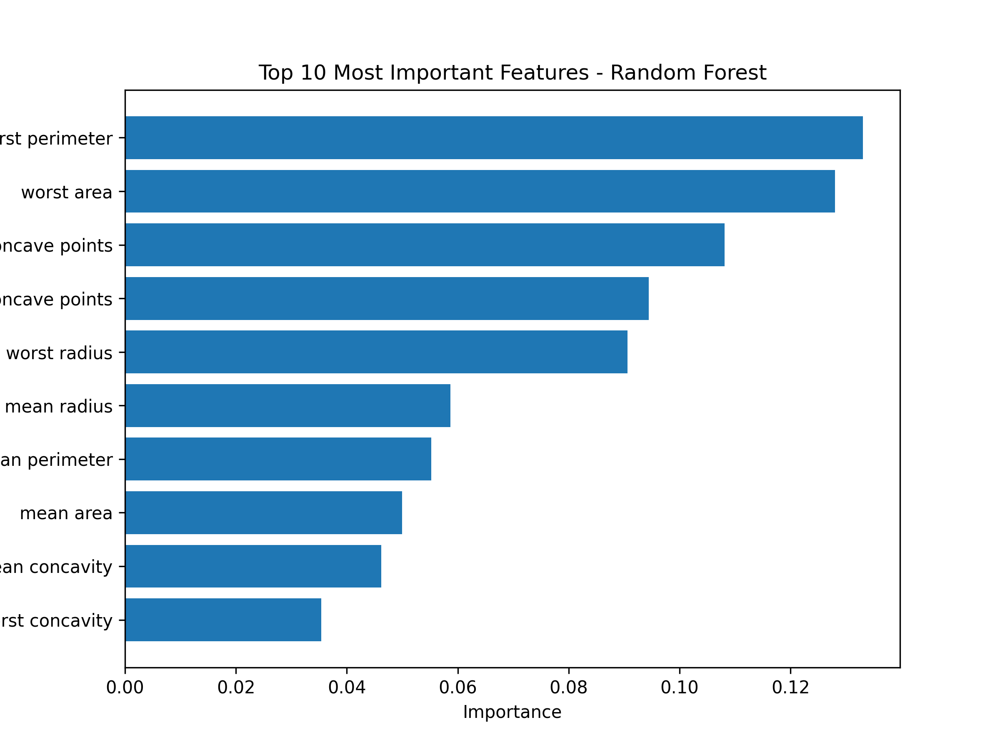

# Breast Cancer Classification with Machine Learning

## Project Overview

This project applies machine learning techniques to classify breast tumors as **malignant** or **benign** using the Breast Cancer Wisconsin dataset.

The analysis explores tumor morphometric features extracted from medical images and evaluates different machine learning models for diagnostic prediction.

---

## Dataset

The dataset used is the **Breast Cancer Wisconsin Diagnostic Dataset**, available through `scikit-learn`.

It contains:

- 569 tumor samples
- 30 numerical features
- binary diagnosis:
  - 0 = malignant
  - 1 = benign

The features describe properties such as:

- radius
- perimeter
- area
- concavity
- concave points
- texture
- smoothness

---

## Methods

The analysis workflow includes:

1. Data loading and inspection
2. Exploratory Data Analysis (EDA)
3. Correlation analysis
4. PCA visualization
5. Train-test split
6. Model training:
   - Logistic Regression
   - Random Forest
7. Model evaluation using:
   - Accuracy
   - Confusion matrix
   - Classification report
   - ROC curve
   - AUC
8. Feature importance analysis

---

## Results

### Logistic Regression

Accuracy: **0.98**

### Random Forest

Accuracy: **0.96**  
ROC AUC: **0.993**

Both models show strong performance in distinguishing malignant from benign tumors.

---

## Feature Importance

The Random Forest model identified several important tumor characteristics:

- worst perimeter
- worst area
- worst concave points
- mean concave points
- worst radius

These features are associated with tumor size and irregular shape, which are known indicators of malignancy.

---

## Example Visualization

### ROC Curve Comparison

### Feature Importance

---

## Technologies Used

- Python
- pandas
- numpy
- matplotlib
- scikit-learn
- Jupyter Notebook

---
